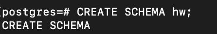
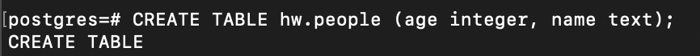
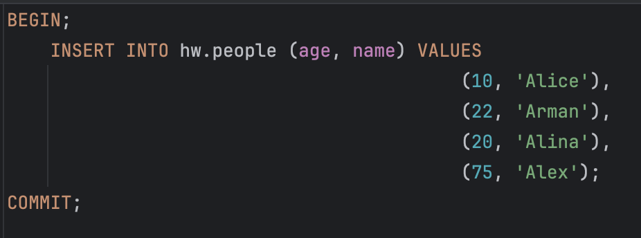
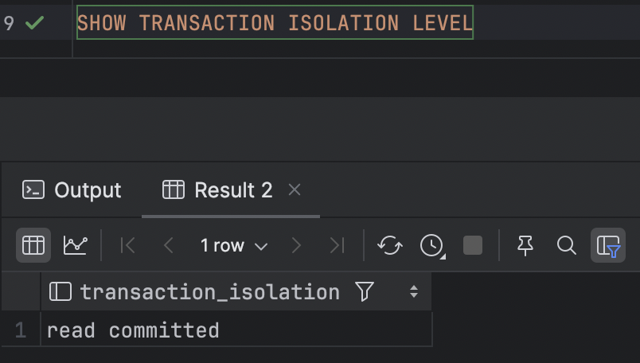
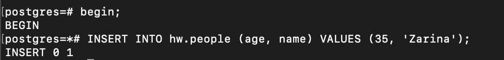
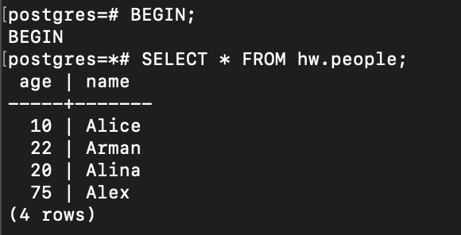
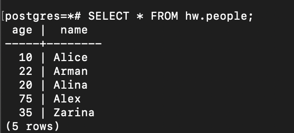
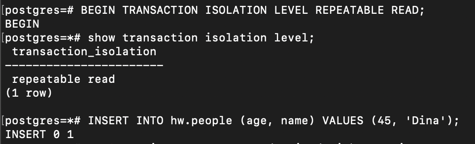
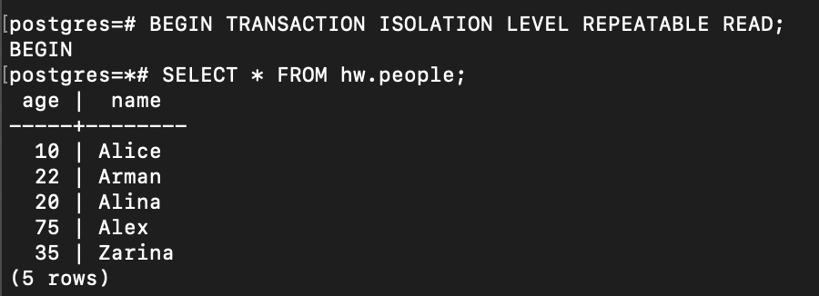
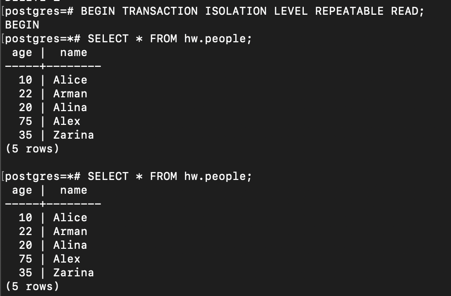

# Создана новая схема

# Создана новая таблица 

# Добавлены данные в таблицу

# Уровень изоляции

# Начата транзакция в 1 окне и добавление новой строки

# Просмотр всех записей во 2 окне

## В данном случае мы не видим новой записи, т.к. уровень изоляции `Read commited` показывает только уже 
## закомиченные изменения в таблице. Видны только те данные, которые были зафиксированы до начала запроса;
## т.к новые данные были внесены в процессе выполнения запроса параллельными транзакциями, то они не видны в 1ой транзакции.

# Завершаем транзакцию в 1 окне

# Смотрим снова все записи

## Теперь мы видим новую запись, т.к. транзакция была успешно завершена и запись добавлена в таблицу

# Добавляем и проверяем новую запись в транзакциях с уровнем изоляции `Repeatable read`

## Новая запись не видна; т.к. транзакция не завершена и изменения не внесены; 
## а транзакция во втором окне видит только уже закомиченные изменения 

# Завершили транзакцию в первом окне и снова просматриваем записи во втором окне

## В данном случае новая запись вновь не видна, потому что в транзакциях 
## с уровнем изоляции `Repeatable read` берётся "снимок" БД на момент выполнения первой операции, 
## а так как мы уже ранее выполняли команду `SELECT` до выполнения `COMMIT`, то и получили только данные ДО изменений.