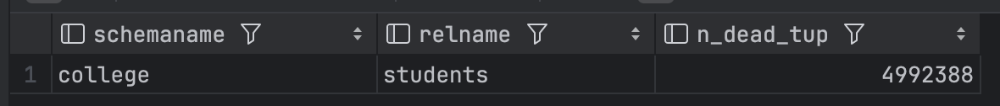
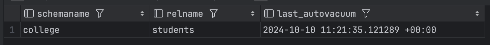
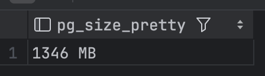

## 1. Создана схема `College` и в ней таблица `Students` с полем `ID`
## 2. С помощью команды `SELECT pg_size_pretty(pg_total_relation_size('college.students'));` просматриваем размер файла таблицы с 1млн строк
>
## 3. С помощью команды `SELECT schemaname, relname, n_dead_tup FROM pg_stat_all_tables WHERE relid='college.students'::regclass \gx` смотрим количество мертвых строк в таблице после 5-и разового обновления
>
## С помощью команды `SELECT schemaname, relname, last_autovacuum FROM pg_stat_user_tables WHERE schemaname = 'college' AND relname = 'students';` проверяем время запуска автовакуума
>
## 5. Снова обновляем все строчки и проверяем размер таблицы 
>
## 6. С помощью команды `ALTER TABLE college.students SET (autovacuum_enabled = false);` отключаем автовакуум
## 7. Размер файла после 10-и кратного обновления всех строк:
>
>
># Результат:
> 5 из 10 циклов попали в ячейки, они были почизены автовакуумом, но не удалены, а оставшиеся циклы увеличили тпблицу, выделением новых страничек, и поэтому размер таблицы увеличился