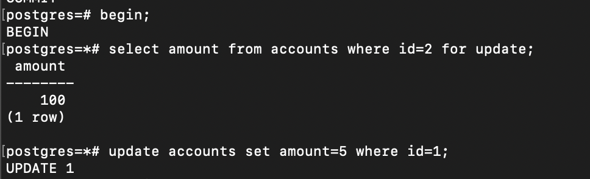
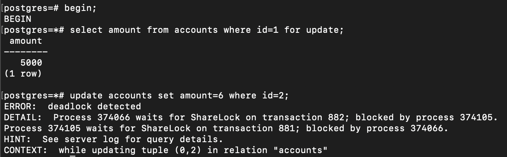

> В первом окне начинаем транзакцию и делаем SELECT FOR UPDATE для строчки с id=2;
> Во втором также начинаем транзакцию и делаем SELECT FOR UPDATE для строчки с id=1;
> В 1 окне пытаемся сделать UPDATE для записи с ID=1;
> Во 2 окне пытаемся сделать UPDATE для записи с ID=2
>## Deadlock!
> 
> 
