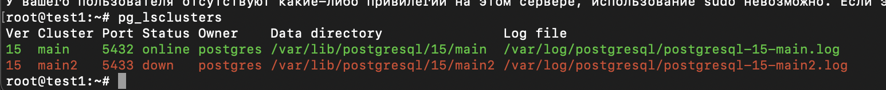
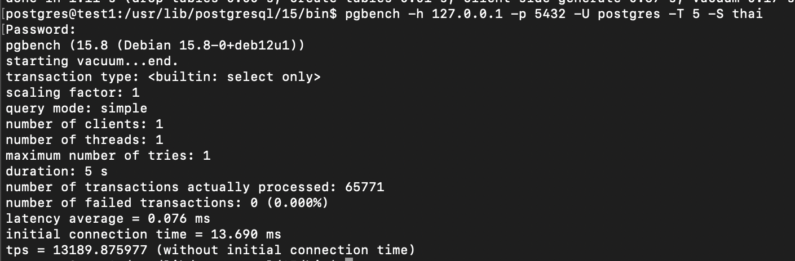

## Создан новый кластер main2
> 
>## С помощью команды `rm -rf /var/lib/postgresql/15/main2/*` очищаем директорию под бэкап.
>## Делаем бэкап `pg_basebackup -p 5432 -R -h 127.0.0.1 -U postgres -D ./main2`
>## Запускаем реплику `pg_ctlcluster restart 15 main2`
>## Делаем замер 
> 
># Вывод: Производительность в обоих случаях одинаковая