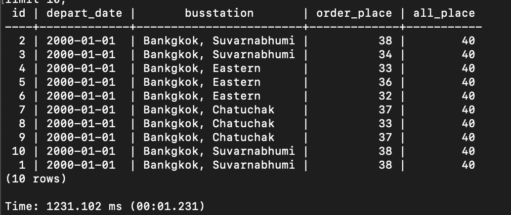

## Изначально запрос выполняется 9 секунд.
>## Добавляем индексы на внешние ключи:
```
create index idx_fkbus on book.ride(fkbus);
create index idx_fkschedule on book.ride(fkschedule);
create index idx_fkroute on book.schedule(fkroute);
create index idx_fkseatcategory on book.seat(fkseatcategory);
create index idx_fkbusstationfrom on book.busroute(fkbusstationfrom);
create index idx_fkbusstationto on book.busroute(fkbusstationto);
create index idx_fkride on book.tickets(fkride);
create index idx_fkseat on book.tickets(fkseat);
create index idx_fkbus on book.seat(fkbus);
```
>## Теперь запрос выполняется 1.2 секунды
> 
