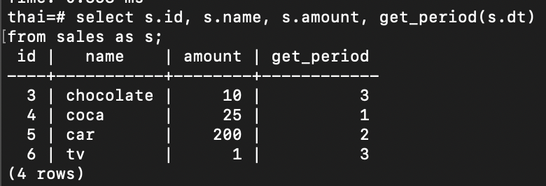

## Создаем новую таблицу sales
> `create table sales (id serial, name text, amount integer, dt date);`
>## Добавляем данные 
> `insert into sales (name, amount, dt) values ('chocolate', 10, '2024-12-12'), ('coca', 25, '2024-01-10'), ('car', 200, '2024-06-06'), ('tv', 1, '2024-09-09');`
>## Функция:
```
CREATE FUNCTION get_period(_date in date) returns int
language plpgsql as
$$
declare
    month                integer;
    period integer;
BEGIN
SELECT date_part('month', _date::date)::integer into month;
    SELECT CASE
               WHEN month > 0 and month < 5 THEN 1
               WHEN month > 4 and  month < 9 THEN 2
               WHEN month > 8 and month < 13 THEN 3
               END
                AS m
    INTO period;
    RETURN period;
END;
$$;
```
>## Вызываем функцию из select:
> 