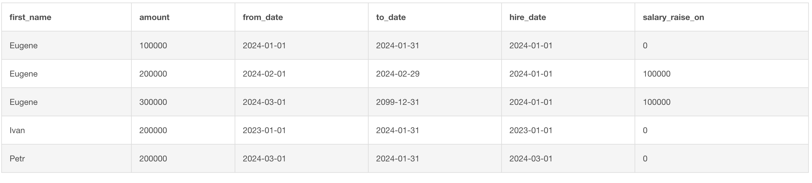

>## Проанализировать данные о зарплатах сотрудников с использованием оконных функций:
```
SELECT e.first_name,
       s.amount,
       s.from_date,
       s.to_date,
       e.hire_date,
    CASE
        WHEN e.hire_date=s.from_date THEN 0
        ELSE s.amount - lag(amount, 1, null) over (partition by id order by s.from_date)
    END
        AS salary_raise_on
    FROM employee as e
    JOIN salary s on e.id = s.fk_employee;
```
> 